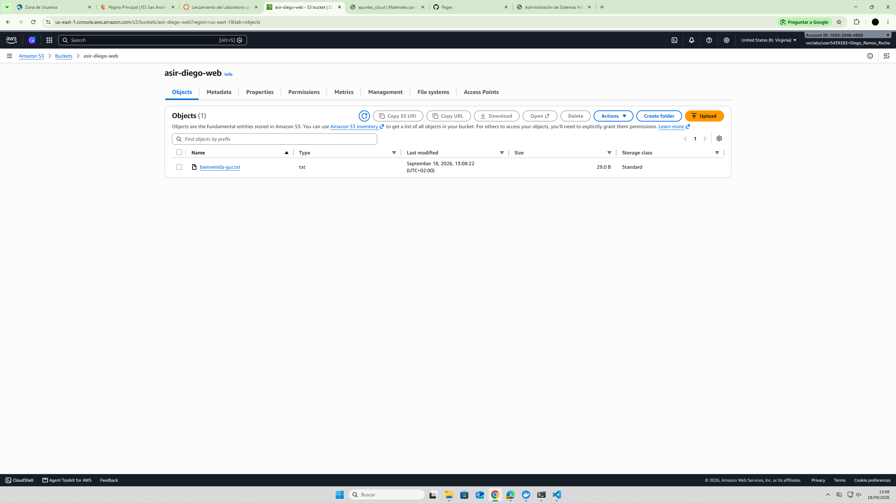
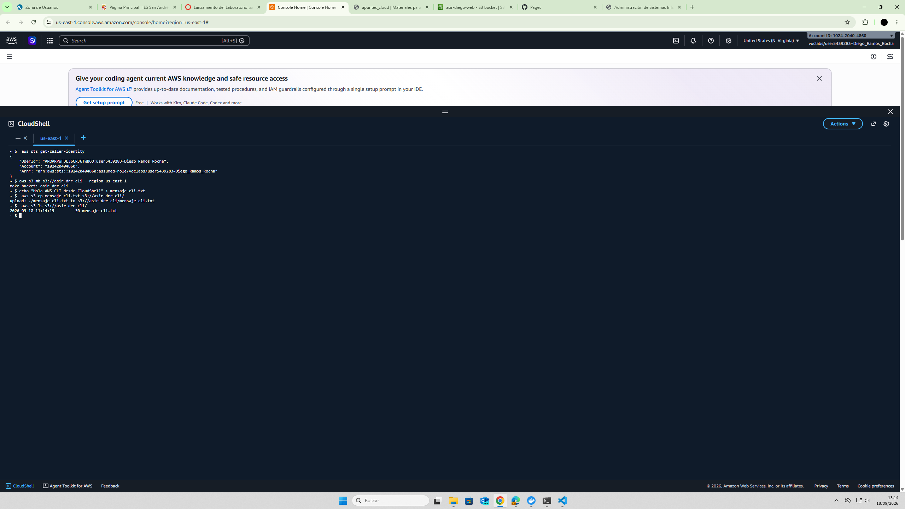
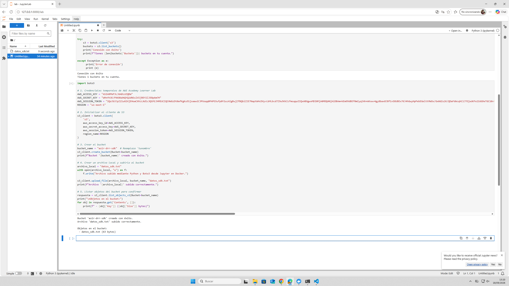
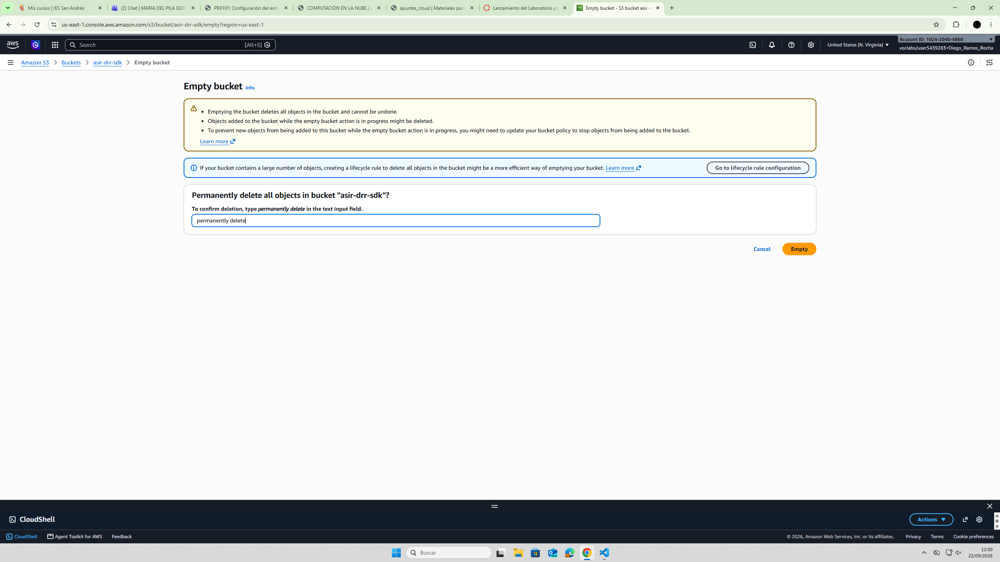
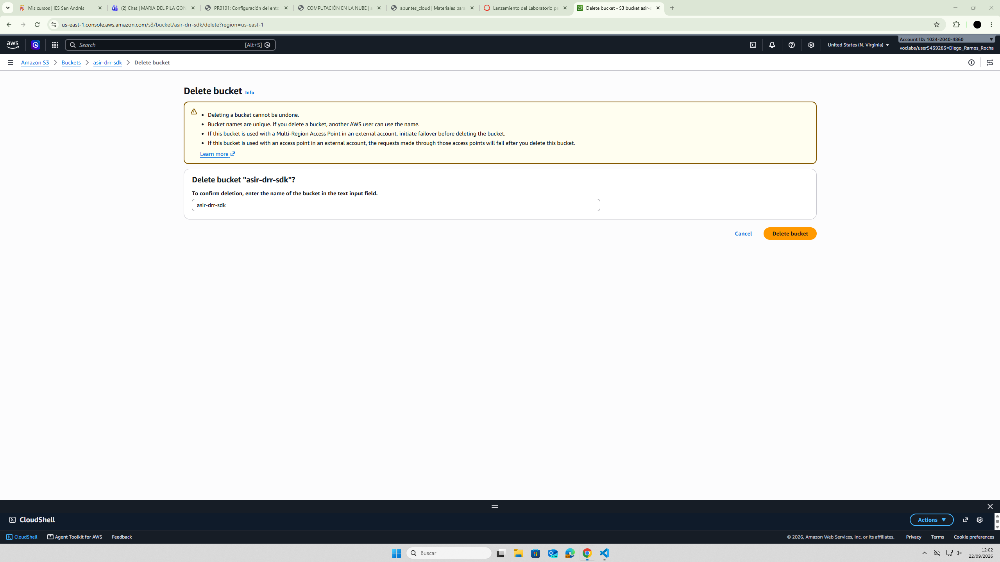
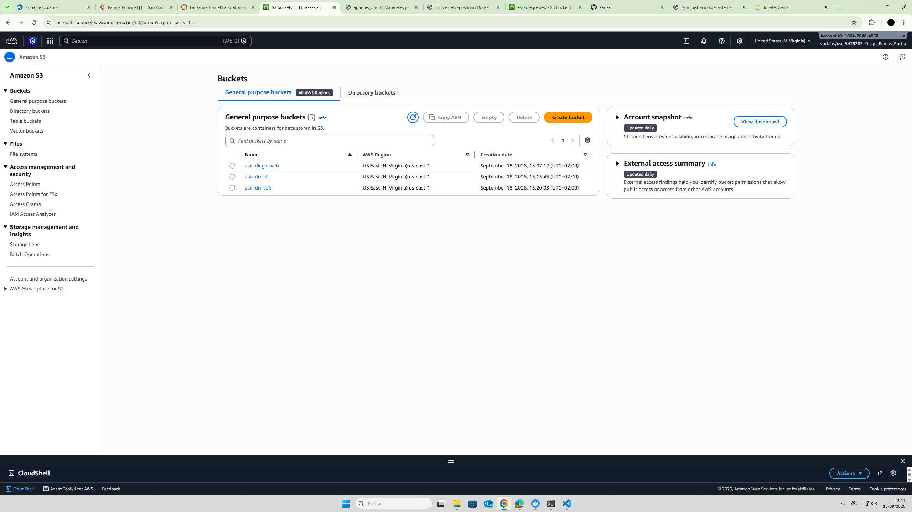

# PR0101: Configuración del entorno

## Creación del bucket desde interfaz

### En este paso vamos a crear un bucket desde la interfaz de AWS Academy, y subiremos un archivo de texto.

## Creación del bucket desde CLI y copia de archivo

### Aquí crearemos un bucket desde la CLI y también crearemos un archivo de texto con contenido, el cual será subido al bucket.

## Ejecución del Script en Python con Boto3

## Tarea final y limpieza de recursos

## Captura final

## Conclusión final

### ¿En qué casos de administración de sistemas recomendarías usar la consola web, en cuáles la CLI y cuándo recurrir a un script con SDK?
Usaría la consola web cuando queramos pensar menos los comandos y queramos que todo sea más práctico, ya que con la interfaz vas viendo lo que haces en el momento y lo considero más cómodo.
La CLI solo la usaría con un buen conocimiento de los comandos, y cuando quiera ir un poco más rápido que con la terminal.
Por último usaría un script con SDK cuando quiera crear muchos buckets seguidos, ya que es la manera más rápida y funcional.
