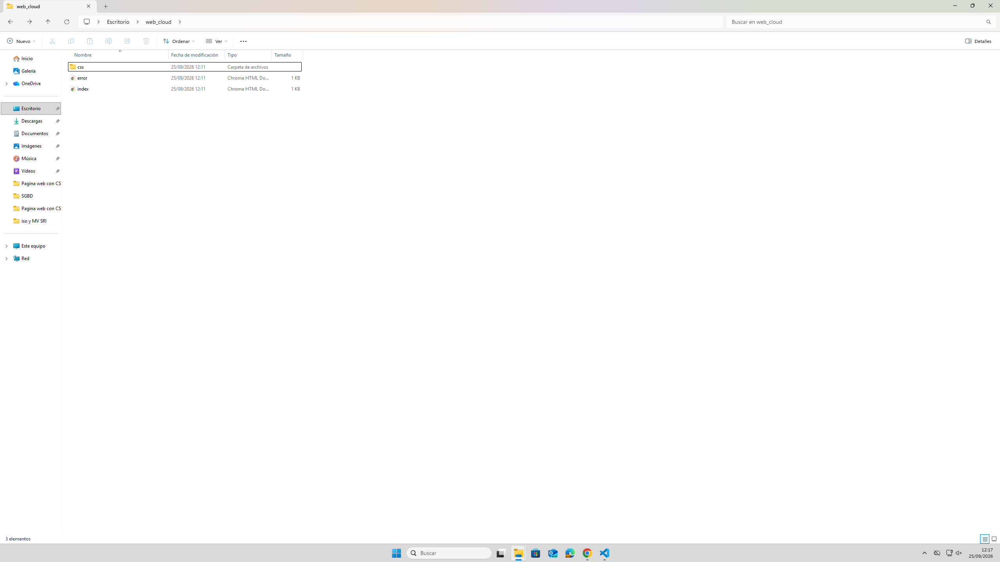
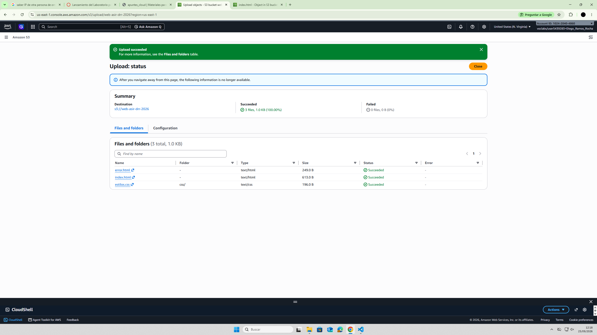
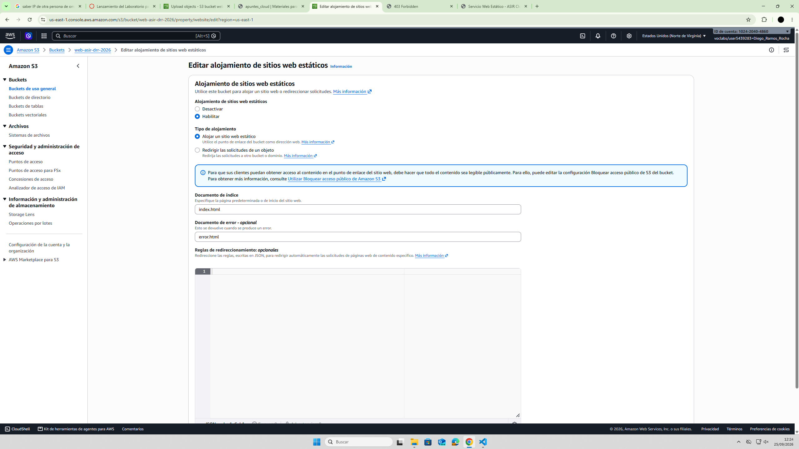
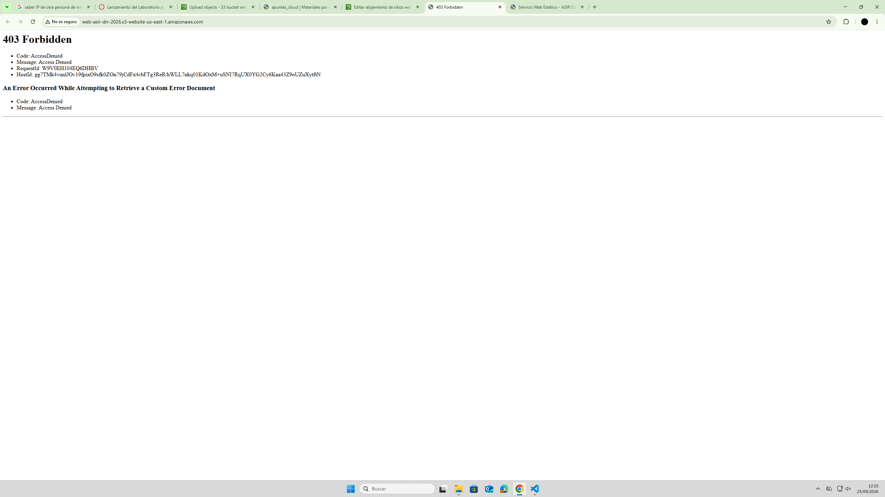
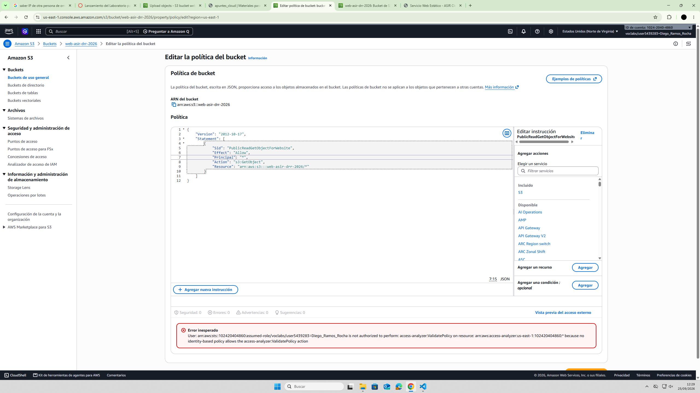
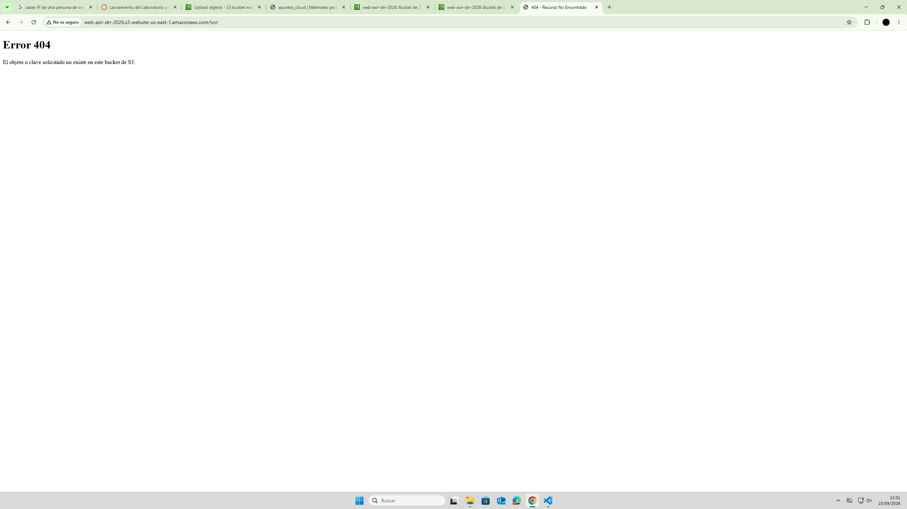
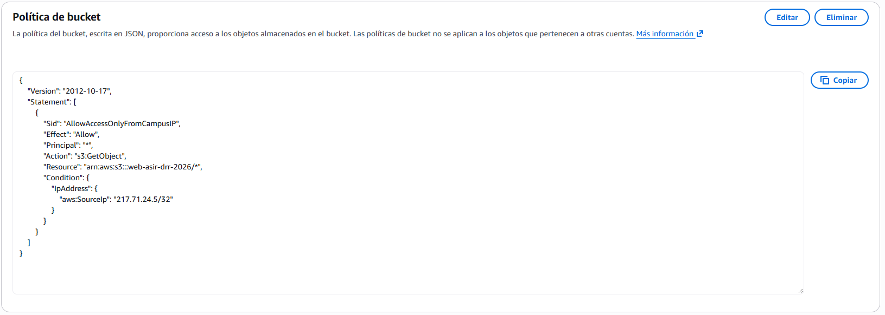

# PR0201: Despliegue de sitio web estático en AWS S3

## Fase 1: Preparación del entorno local

### Creamos la carpeta en local

## Fase 2: Creación y subida de archivos al Bucket S3

## Pregunta: ¿Por qué puedes ver el archivo sin errores en este punto? Observa la URL con tokens en la barra de direcciones.

### Lo podemos ver sin problemas porque tenemos un token de acceso que nos permite visualizar la página.

## Pregunta: ¿Qué código y mensaje devuelve el XML devuelto por Amazon S3?

### Nos devuelve un error de acceso (403), y dice que no tenemos permiso para ver los siguientes contenidos.

## Fase 3: Habilitación de “Static Website Hosting”

### Nos da error porque el bucket sigue en modo privado.

## Fase 4: Desbloqueo y Política de Acceso JSON

### Habilitamos el acceso al punto de acceso del Bucket cambiando la política.

### Comprobamos que el index.html y error.html funcionen correctamente.

## Fase 5: restricción de acceso por red (Dirección IP)

### Añadimos la línea a la política de que solo deje entrar a nuestra IP.

### Accedemos desde el móvil para ver si funcionó, desde otra red claro.

