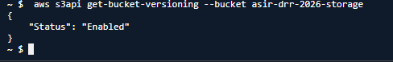
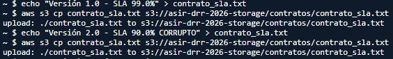
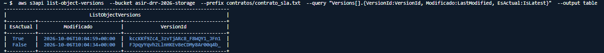
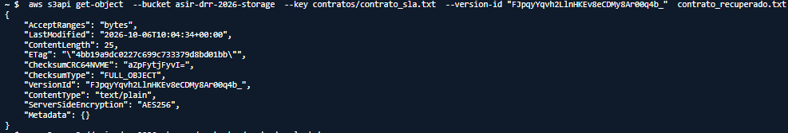
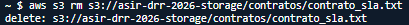
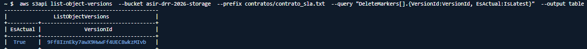
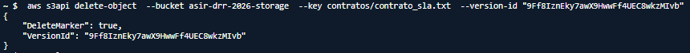

# PR0203: Protección contra desastres y optimización de almacenamiento
## Fase 1: Creación del repositorio y activación de versionado

## Fase 2: Simulación de sobreescritura y recuperación de versiones

## Fase 3: Simulación de borrado y análisis de marcas de borrado

