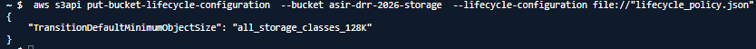
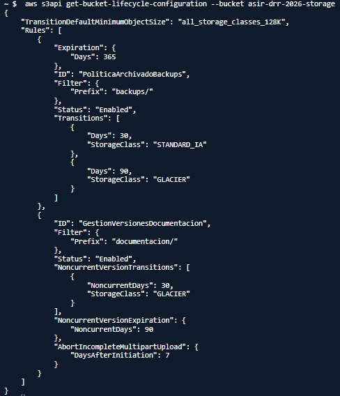
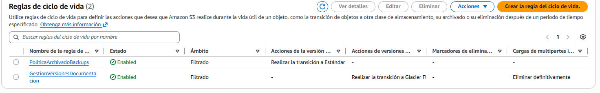

# PR0203: Protección contra desastres y optimización de almacenamiento
## Fase 1: Creación del repositorio y activación de versionado

## Fase 2: Simulación de sobreescritura y recuperación de versiones

## Fase 3: Simulación de borrado y análisis de marcas de borrado

## Fase 4: Configuración de políticas de ciclo de vida (Lifecycle Rules)

## Fase 5: Estudio económico y comparativa de costes

| Clase de almacenamiento | Coste aprox. ($/GB/mes) | Tiempo mínimo de facturación | Tamaño mínimo facturable | Tiempo de recuperación (Retrieval) |
|---|---|---|---|---|
| **S3 Standard** | ~$0.023 | Ninguno | Ninguno | Inmediato (milisegundos) |
| **S3 Standard-IA** | ~$0.0125 | 30 días | 128 KB | Inmediato (milisegundos) |
| **S3 Glacier Flexible Retrieval** | ~$0.0036 | 90 días | Sin mínimo de objeto (40 KB adicionales de metadatos) | Rápida: 1–5 min / Estándar: 3–5 h / Masiva: 5–12 h |
| **S3 Glacier Deep Archive** | ~$0.00099 | 180 días | Sin mínimo de objeto (40 KB adicionales de metadatos) | Estándar: hasta 12 h / Masiva: hasta 48 h |

## Fase 6: Preguntas y respuestas

### 1. Riesgo de microficheros en clases IA/Glacier: si una aplicación sube 500.000 ficheros de log de 2 KB cada uno a S3 Standard-IA, ¿por qué aumentaría la factura en lugar de reducirse?:
#### S3 Standard-IA tiene un tamaño mínimo facturable de 128 KB por objeto. Aunque cada fichero ocupe solamente 2 KB, AWS cobrará como si ocupara 128 KB.

### 2. Borrado prematuro: si un script de backup elimina un fichero de 10 GB en S3 Glacier Flexible Retrieval solo 15 días después de haberlo subido, ¿cuántos días adicionales cobrará AWS en concepto de penalización por borrado temprano?
#### S3 Glacier Flexible Retrieval establece un periodo mínimo de almacenamiento de 90 días.

### 3. Cálculo de ahorro: una empresa almacena 20 TB de copias de seguridad estáticas que casi nunca se leen. ¿Cuánto pagaría al mes en S3 Standard frente a mantenerlas en S3 Glacier Flexible Retrieval?
#### 20 TB = 20.000 GB S3     Standard: 20.000 × 0.023 = 460 $/mes       S3 Glacier Flexible Retrieval: 20.000 × 0.0036 = 72 $/mes      Ahorro mensual: 460 - 72 = 388 $/mes